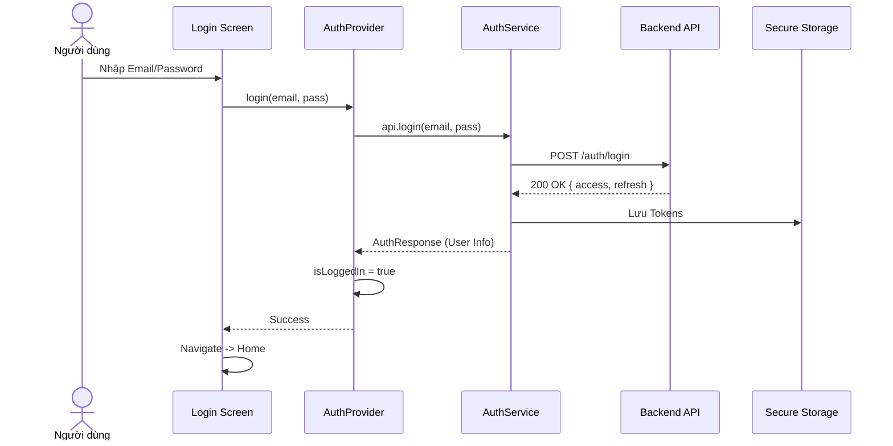
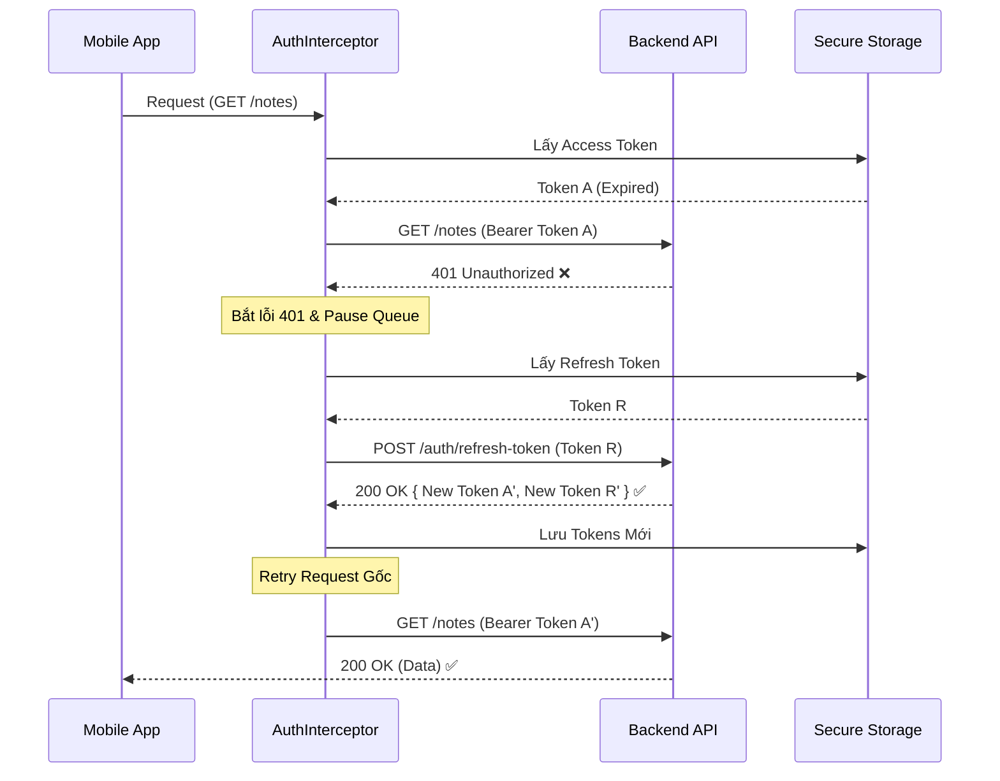

# 🔐 Authentication Flow

Hệ thống sử dụng cơ chế **JWT (JSON Web Token)** với `accessToken` (ngắn hạn) và `refreshToken` (dài hạn).

## 📊 Quy trình Đăng nhập (Login Flow)

---

## 🔄 Cơ chế Tự động Refresh Token (Interceptor)

Khi Access Token hết hạn, hệ thống tự động làm mới mà không cần người dùng đăng nhập lại.

## 🛡️ Secure Storage

Token được lưu trữ bằng `flutter_secure_storage`:
-   **Android**: EncryptedSharedPreferences (Keystore)
-   **iOS**: Keychain

Tuyệt đối không lưu token vào `SharedPreferences` thông thường.
