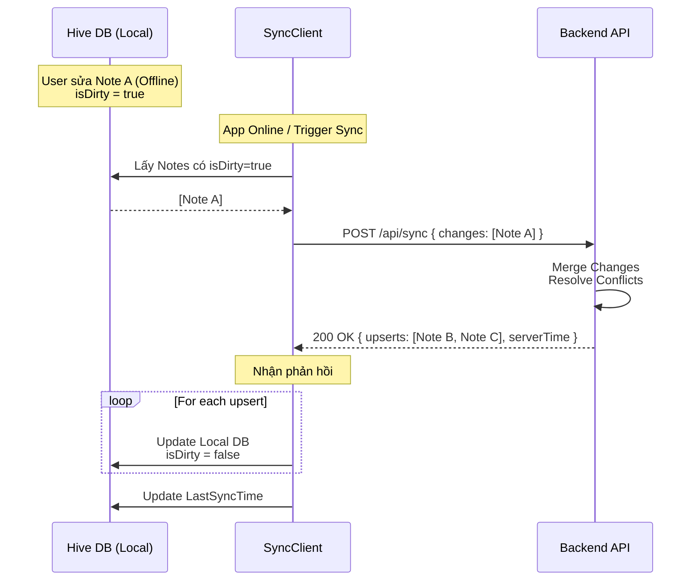

# 🔄 Synchronization Mechanism

NoteVui sử dụng chiến lược **Offline-First**. Ứng dụng luôn hoạt động với dữ liệu cục bộ (Hive) và đồng bộ với Server khi có mạng.

## 策略 Chiến lược đồng bộ

1.  **Local First**: Mọi thao tác ghi chú (Thêm/Sửa/Xóa) đều ghi vào Hive trước. Đánh dấu `isDirty = true`.
2.  **Background Sync**: Khi có mạng, ứng dụng gửi các ghi chú bị thay đổi (`isDirty`) lên Server.
3.  **Conflict Resolution**: Server là "Source of Truth". Tuy nhiên, Client sử dụng timestamp `updatedAt` để quyết định ghi đè nếu cần thiết (Last Write Wins).

## 📡 Quy trình Đồng bộ (Sync Flow)



## 📦 Data Models

### Note Local Model (Hive)
```dart
class NoteModel {
  String id;          // UUID
  String title;
  String content;
  bool isDirty;       // Đánh dấu cần đồng bộ
  DateTime updatedAt; // Timestamp
  // ...
}
```

### Sync Request Payload
```json
{
  "lastSyncTime": "2024-02-13T10:00:00Z",
  "changes": [
    { "clientId": "uuid...", "title": "Updated Title", ... }
  ]
}
```
